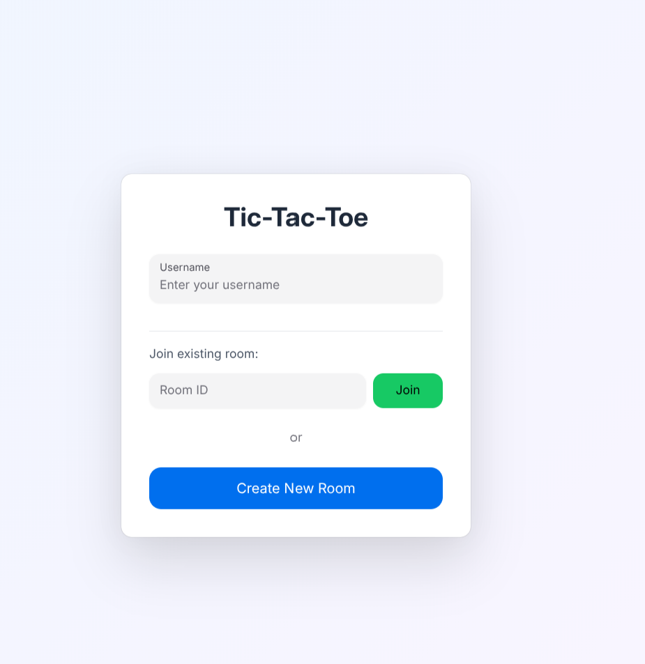
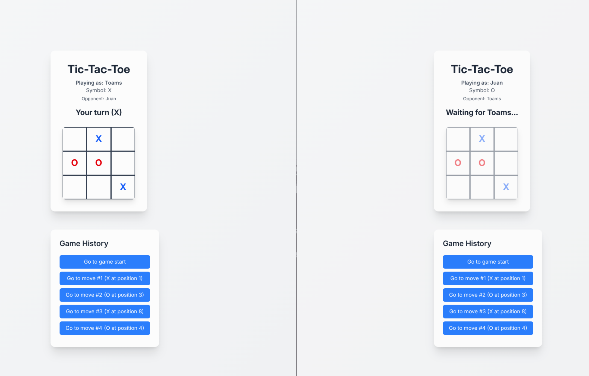
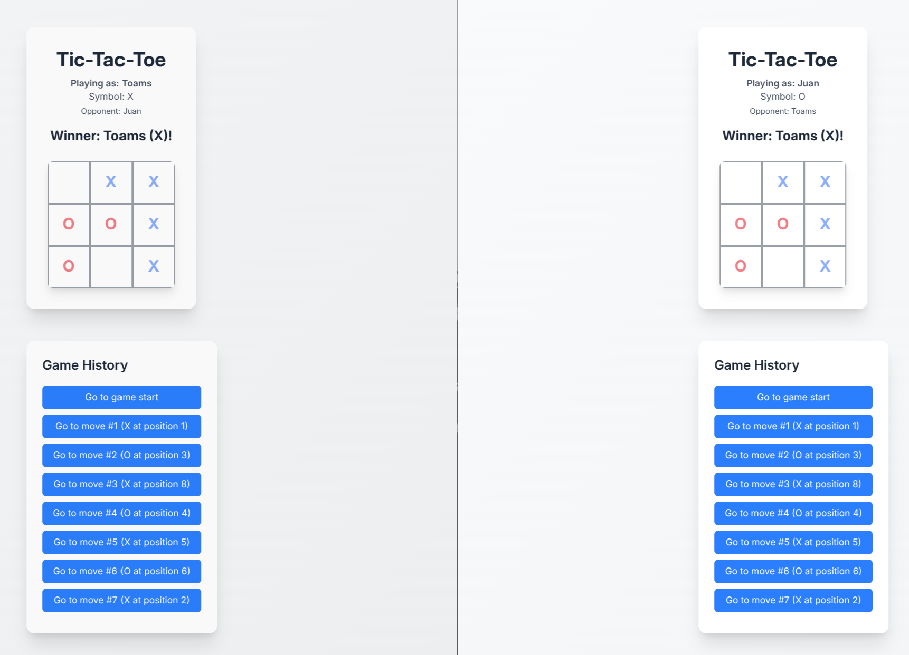
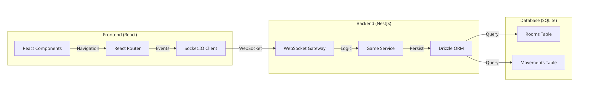

# Tic Tac Toe Multiplayer

## Descripción

Aplicación interactiva de Tic Tac Toe para dos jugadores en tiempo real, desarrollada como un monorepo con arquitectura cliente-servidor.

## Características

- ✅ Crear y unirse a salas de juego
- ✅ Jugar en tiempo real con WebSockets
- ✅ Persistencia de salas y estado del juego
- ✅ Historial de movimientos con opción de retroceso
- ✅ Recuperación de salas desde la base de datos con historial completo

## Stack Tecnológico

### Frontend
- **React** - Interfaz de usuario interactiva

### Backend
- **NestJS** - Framework de servidor
- **Socket.IO** - Comunicación en tiempo real
- **Drizzle ORM** - Mapeo de objetos
- **SQLite** - Base de datos relacional

### Deployment
- **Docker** - Containerización
- **AWS** - Infraestructura en la nube

## Demostración






## Estructura del Proyecto

```
├── backend/
│   ├── src/
│   │   ├── main.ts
│   │   ├── app/
│   │   │   ├── app.controller.ts
│   │   │   ├── app.gateway.ts
│   │   │   ├── app.module.ts
│   │   │   └── app.schema.ts
│   │   └── drizzle/
│   │       ├── drizzle.client.ts
│   │       └── drizzle.module.ts
│   └── package.json
├── frontend/
│   ├── src/
│   │   ├── app.css
│   │   ├── hero.ts
│   │   ├── providers.tsx
│   │   ├── root.tsx
│   │   ├── routes.ts
│   │   └── routes/
│   │       ├── home.tsx
│   │       └── room.tsx
│   └── package.json
└── docker-compose.yml
```

## Instalación y Ejecución

```bash
docker-compose up
```
